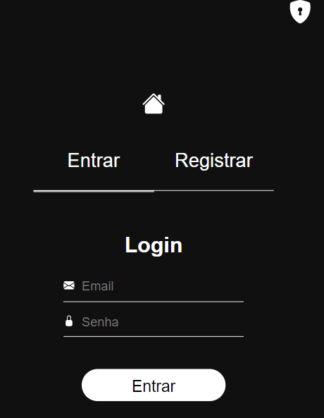

# Mini Rede Social

# Telas do projeto 
<div float="left">
    
    
    <p>Após o login</p>
    
    
    
    
</div>

# Sobre 
<p>Projeto feito para tentar simular uma mini rede social, com o objetivo de testar meus conhecimentos em um projeto um pouco mais trabalhoso.</p>
<p>O usuário após o login pode realizar a criação de um post que ficará visível para outros usuários. Além disso esse post pode ser editado ou deletado. Em cada post também tem as opções de dar like e adicionar comentários. A página de perfil permiti a edição do perfil do usuário, só não é permitido a edição do email.</p>

# Modelo Conceitual 
## Back end


## Front end

<p><a href="https://www.figma.com/file/HGDJlIQKI0kJ4HJNEVK08G/Untitled?node-id=0%3A1">Clique aqui</a> para ver no Figma</p>

# Tecnologias utilizadas 
## Back end
- Nodejs / Express
- MongoDB
- JWT

## Front end
- HTML / CSS
- React
- Toolkit(gerenciamento de estado)

# Executando o projeto 
## Back end
```bash
# clonar o projeto
git clone https://github.com/diegocruz-s/msr

# entrar no diretório
cd backend

# criar arquivo .env na raíz do diretório back end e passar as informações
PORT=5000
SECRET_TOKEN='string que você escolher'

# instalar as dependências 
npm install

# rodar o back end
npm start
```

## Front end 
```bash
# entrar no diretório
cd frontend

# instalar as dependências
npm install

# rodar o projeto
npm start
```

# Autor
<p>Diego Cruz's</p>
<a href="https://www.linkedin.com/in/diego-cruz-56436b248/">https://www.linkedin.com/in/diego-cruz-56436b248/</a>